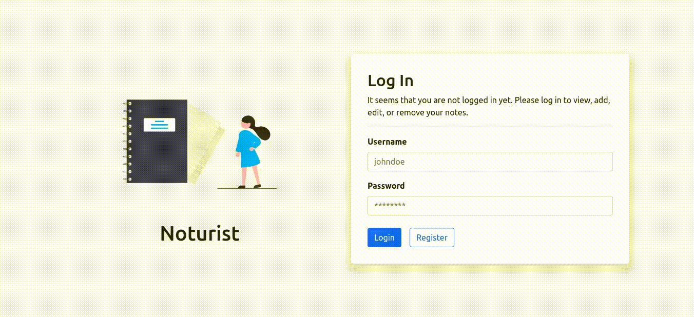

<!-- markdownlint-disable MD032 MD033-->

# **alvitoraidhy/noturist**



---

## **About the project**

- The web application features a simple account-based note management system. The front-end provides an interactive single page application to the users, while the back-end handles the storage of the accounts and the notes, and the logic of the application.
- This application relies heavily on Next.js and Prisma.

---

## **Installation**

- Make sure that Node.js, NPM, and PostgreSQL are installed.
- Run `npm install` to install all mandatory packages.
- Create a file named `.env` with the following content:

```
DATABASE_URL=<url to postgresql database>
```

- Run `npx prisma migrate deploy` to create the tables on the database.

---

## **Usage**

- Run `npm run build` and `npm start` for production.
- Alternatively, run `npm run dev` for development.

---

## **License**

See the license in the '**[LICENSE](LICENSE)**' file.
